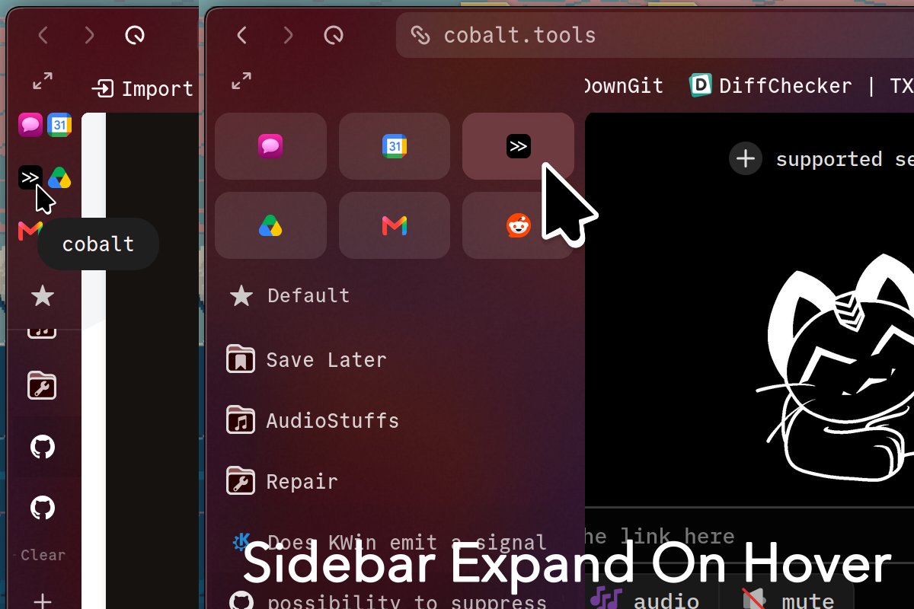

# Sidebar Expand on Hover

Personal fork (still works as of 1.21.15b) to add feature + aesthetics parity with my [past implementation of a expand-sidebar-on-hover mod](https://github.com/pythonr0ck/zen-mods).

### Changes so far:
- ADD: Move tab sidebar downward of nav buttons [MvSB]
- feat: Collapsed Essentials Styles [ESS]
  - Compact-Style: Make all essential tabs visible in a compact grid, allows for quick essentials tab switching
- feat: Collapsed Footer Buttons Layout [CFL]
- fix: selective suppression during delay on hover
  - fixes [#19](https://github.com/StormAnon/zen-sidebar-expand-on-hover/issues/24)

**IMPORTANT**: Turn the mod off or on with the fullscreen toggle (F11)  
**IMPORTANT**: Use the mod in single toolbar or multiple toolbars mode, never on collapsed toolbar mode

## Customization Options
In the mods menu, clicking on the gear icon will give you several customization options:
- Collapsed Essentials Styles:
  - None: Always in Expanded State; best for performance
  - *Compact: Make all essential tabs visible in a compact grid*
  - Vertical: Make all essential tabs visible in the collapsed sidebar
- Fade unloaded (sleeping) tabs
- *Disable window dragging*
- Control Collapsed and expanded widths
- Control the delay to expand and animation Speeds
- *Hide or show the workspace indicator*
- Collapsed Footer Buttons Layout:
  - None: Always in Expanded State; best for performance
  - Centered Active Workspace: Show current workspace (same as the original mod)
  - *Standard: Center Buttons, dynamically show when item is being downloaded*

## How to Download
> Occassionally, I may make some breaking changes to the mod preferences. Sometimes a full reinstall of the mod is required.

### Download with Sine Mod Manager
Using Sine will allow this mod to be updated as this mod receives updates through github.

> Sine Mod Manager: <https://github.com/CosmoCreeper/Sine>

1. Download Sine Mod Manager (if not already installed)
2. Open Settings -> Sine Mods (`about:preferences#sineMods`)
    - You can enable auto-updates here too
3. Under the "add your own [mod] locally from a GitHub repo." input box, insert `pythonr0ck/zen-sidebar-expand-on-hover/tree/sine` and click on the install button.
